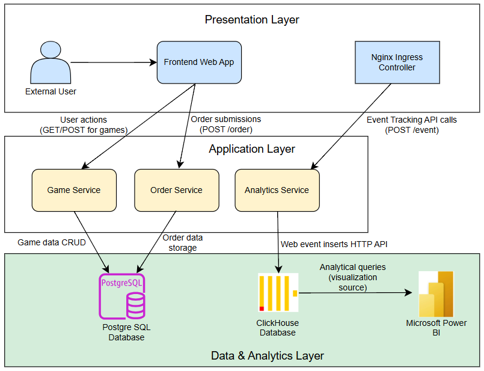
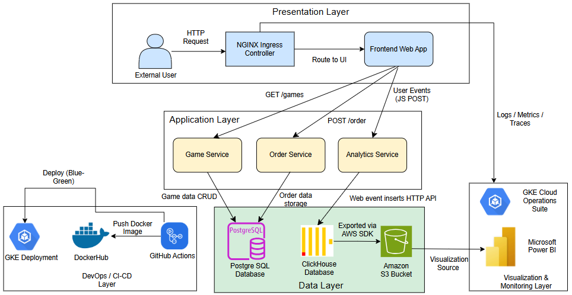

## 1.	Introduction
Lugx Gaming is an online storefront that sells video games, aiming to modernize its platform by moving to a cloud-native infrastructure. The main goal of this project was to deploy their existing frontend application together with backend microservices inside a Kubernetes environment, allowing for better scalability, security, and fault tolerance. In addition to deploying the application, this project also focused on capturing real-time user interaction data through web analytics and then visualizing this data with Microsoft Power BI to gain useful business insights. This report details the design of the system, the technologies employed, the deployment process, the security measures implemented, and the testing methodology. It aims to provide a comprehensive understanding of the solution, highlighting both technical and practical considerations.                                              

## 2.	Solution Architecture
The architecture is based on microservices, a design pattern where independent services handle specific functions. This approach improves flexibility and makes scaling easier, as each service can be managed separately.
- Frontend: This is the web application interface that users interact with. Developed by Lugx Gaming, it allows users to browse available games and place orders.
- Game Service—Created using FastAPI, this service manages game data such as the name, category, release date, and price. It supports all CRUD (create, read, update, delete) operations and stores data in a PostgreSQL relational database.
- Order Service—Also implemented using FastAPI, it records orders submitted by users, including cart items and total cost, ensuring transactional consistency with the relational database.
- Analytics Service—JavaScript embedded in the frontend collects interaction metrics (page views, clicks, scroll depth, session time). This data is sent to the Analytics Service, which then formats and writes data to ClickHouse using its HTTP API.

All services are containerized using Docker and orchestrated by Kubernetes (Minikube for development and Google Kubernetes Engine for production). An NGINX Ingress controller handles routing and load balancing, exposing the frontend and API endpoints securely.

            
Figure 1- Solution Architecture        

#### System Flow Overview
- Users interact with the frontend by browsing pages, viewing game listings, and clicking interface buttons.
- The frontend sends API requests to backend services such as GET /games and POST /orders.
- Game Service and Order Service interact with PostgreSQL to store or retrieve necessary data.
- User events such as page_view, add_to_cart, search_click, scroll depth percentages, and category_click are captured via JavaScript and sent to the Analytics Service backend.
- The Analytics Service writes these events to ClickHouse via the HTTP API into the web_events table.
- Game and Order services persist their data into PostgreSQL, including game details like title, genre, and price, and order details like cart items, total cost, and timestamps.

Microsoft Power BI fetches data from ClickHouse, which is first exported and uploaded to Amazon S3 using a custom API that connects via the AWS SDK for Amazon S3, facilitating seamless data transfer. The resulting interactive dashboards present key engagement metrics through charts such as
- Event Count by Type
- Page Views by Page
- Scroll Depth Distribution
- Average Session Duration per Page
These visualizations help stakeholders make informed decisions about user interface design and marketing campaigns.                                                                                  

## 3.	Deployment Architecture

This section explains how the system is implemented on cloud infrastructure using Kubernetes (GKE) and other managed services.
Key Deployment Flows
- External user traffic first passes through the NGINX Ingress controller, which directs requests to the correct service or frontend pod.
- GitHub Actions automates CI/CD by building and pushing Docker images and deploying them to Kubernetes using a blue-green deployment model.
- GKE’s Cloud Operations Suite provides observability by collecting logs, metrics, and traces to monitor service health and performance.

        
Figure 2- Deployment Architecture

#### Infrastructure Highlights:
- GKE manages Kubernetes clusters, providing scalable and resilient orchestration of containers.
- The ingress controller enables secure external access with SSL termination and fine-grained routing.
- GitHub Actions enables rapid, automated deployments with rollback capability through the blue-green deployment pattern.
- Observability tools give insights into the system’s health, enabling quick detection of issues.

This layered deployment ensures the system is both reliable and scalable, meeting modern cloud application standards.  

5.	CI/CD Pipeline Process
To ensure the rapid and reliable delivery of services for the Lugx Gaming platform, a fully automated CI/CD pipeline was implemented using GitHub Actions, Docker Hub, and Google Kubernetes Engine (GKE). The deployment process follows a blue-green deployment strategy, maintaining 100% uptime by routing traffic through the active environment while validating the new deployment in an isolated inactive environment. After each deployment, automated health checks are triggered to validate core functionality.
Pipeline Overview
This pipeline automates the entire lifecycle from source code changes to production deployment while maintaining zero downtime and supporting automated integration testing.
 
Figure 3- CI/CD Pipeline Design
Below is a step-by-step breakdown of how this strategy is implemented through the GitHub Actions pipeline:
•	Trigger on Push to Main Branch: The workflow starts automatically when new code is pushed to the main branch.
•	Checkout Source Code: It pulls the latest application code from the GitHub repository for building.
•	Authenticate to Google Cloud: Using a service account key, the pipeline securely connects to GCP to access the Kubernetes cluster.
•	Set Up SDK and kubectl: The Google Cloud SDK and kubectl are configured to manage deployments.
•	Determine Active vs. Inactive Color: The script checks whether blue or green is currently live and selects the opposite color for deployment.
•	Build and Push Docker Images: Docker images are built for game-service, order-service, and analytics-service, tagged with the Git commit SHA, and pushed to Docker Hub.
•	Deploy to Inactive Environment: New versions are deployed to the inactive color environment for testing.
•	Verify Rollout: The system waits until all pods in the new environment are healthy.
•	Run Integration Tests: Automated tests simulate API calls to confirm all services behave as expected.
•	Switch Ingress to Inactive Color: Once verified, the Ingress is updated to route traffic to the newly tested environment, making it live.
•	Update Active Marker: The deployment process will store the new active color to ensure correct tracking in future releases.
Security and Ethical Challenges in the CI/CD Pipeline
While the CI/CD pipeline greatly enhances the speed and reliability of deployments, it also introduces certain risks that must be handled carefully to ensure the platform remains secure and ethically sound.
•	Credential Management: GitHub Actions requires sensitive credentials (like GCP service keys and Docker tokens). Securely storing them using GitHub Secrets and applying branch protection rules, ensure they remain protected from unauthorized access.
•	Safe Docker Image Handling: There’s always a risk of insecure or malicious code slipping into container images. To prevent this, we use lightweight, verified base images and perform security scans before pushing to Docker Hub.
•	Ingress Exposure: Exposing services to the internet increases the risk of attacks. In production, measures like HTTPS, rate limiting, and endpoint authentication would be essential to mitigate these risks.
•	Pipeline Integrity: To avoid the risk of unauthorized code deployment, the pipeline is restricted to the main branch and only trusted contributors have access. The GKE cluster also uses RBAC for stricter control.
Ethical Considerations:
•	Service Disruption Risks- Automating the CI/CD pipeline introduces the risk of service downtime if a faulty deployment is released. To minimize this risk, it is essential to implement health checks, set up notifications, incorporate fallback mechanisms such as automatic rollbacks or blue-green deployments.
Test Automation Suite
To maintain confidence in each deployment, an automated test suite was built into the CI/CD workflow. This suite checks the core API functionality of all microservices—namely the Game Service, Order Service, and Analytics Service—by simulating real user requests to endpoints like /api/games, /api/orders, and /api/analytics. These tests run immediately after the new version is deployed to the inactive environment (as part of the Blue-Green strategy), acting as a safety net before any changes go live.                       (615)

6.	Runbook: Deploying and Validating the Lugx Gaming Platform

1.	Provision the Kubernetes Environment
Set up a Kubernetes cluster using Google Kubernetes Engine (GKE) or a virtual machine (EC2) with kubeadm. Ensure the cluster has enough compute resources to host all services and database workloads. Install kubectl locally and connect it to the cluster using service account credentials or gcloud CLI. Verify access using kubectl get nodes.
2.     Deploy Databases
PostgreSQL: Use a StatefulSet or Deployment to spin up a PostgreSQL pod. Configure persistent volumes to save data across restarts. Set environment variables for the user, password, and database name utilizing Kubernetes Secrets.
ClickHouse: Deploy ClickHouse using the official Docker image. Set up the HTTP interface for data intake and querying. Expose the service internally within the cluster.
3.     Deploy Microservices
Build Docker images for the following services and push them to Docker Hub:
•	game-service: Manages CRUD operations on game catalog data.
•	order-service: Records purchases, cart data, and timestamps.
•	analytics-service: Receives user event data (scrolls, clicks, session time) and stores it in ClickHouse.
Deploy both blue and green variants for each service (e.g., game-service-blue, game-service-green). Use separate Deployments and Services for each color. All services are exposed internally and routed externally via NGINX Ingress.

4.     Frontend Deployment
Build the static frontend with analytics tracking JS. Deploy it as a pod, exposing it through Ingress. Ensure analytics events POST to /api/analytics/event. Use ConfigMaps or ENV variables to inject API endpoints if needed.
5.     CI/CD Pipeline Execution
Run the GitHub Actions workflow:
•	Authenticates to GKE.
•	Builds and tags Docker images.
•	Deploys to the inactive color.
•	Validates pods using kubectl rollout status.
•	Runs test suite using curl or pytest.
•	Updates Ingress routing to the newly verified environment.
6.     Monitoring and Validation
Enable GKE Observability (Cloud Operations Suite). Monitor logs, metrics, and error rates. Use kubectl get pods and kubectl logs to check container health.
Use ClickHouse queries (SELECT * FROM web_events) to confirm event ingestion.
Visualize results in Microsoft Power BI after exporting analytics data to S3 using a Python boto3 script.
